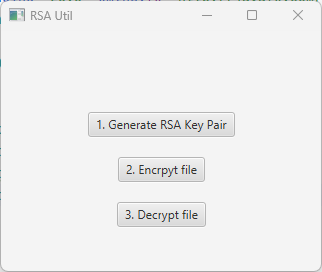

# RSA Generator

## How to
1. Generate rsa key pair "1. Generate RSA Key Pair". The public (pk.txt) and private key (sk.txt) are stored in the project level directory
2. Encrypt file by clicking  "2. Encrypt file"
   - Choosing the public key and then 
   - the file you want to encrypt (e.g [original-text.txt](original-text.txt))
4. Decrypt file by clicking "3. Decrypt file"
   - Choosing the private key and then 
   - the file you want to decrypt

## Code
Logic is located [here](src/main/java/com/example/mada_rsa_project_2/RSAApplicationController.java)